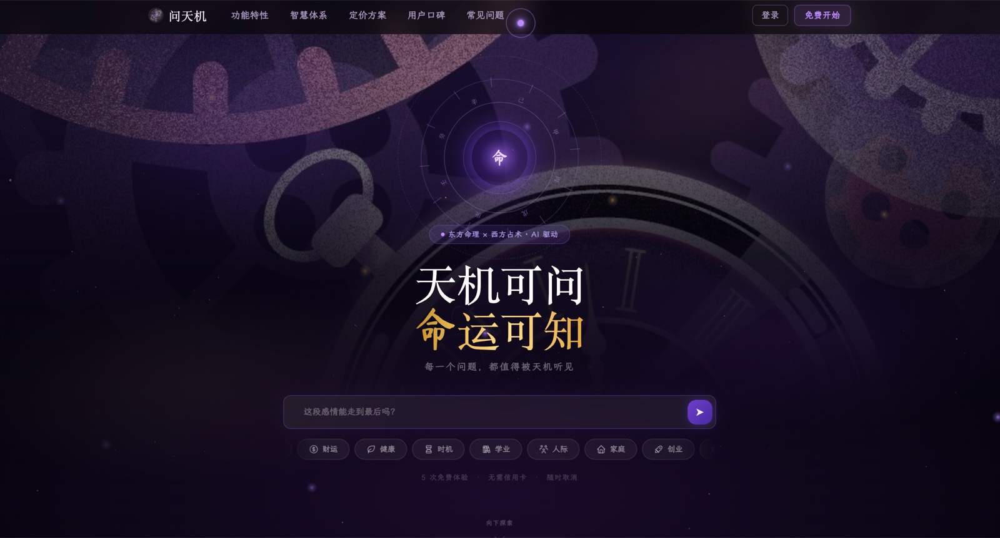

  

<h1 align="center">问天机 · Wentianji</h1>

  <strong>ASK · DECODE · DECIDE</strong> 
  AI 智能东方占卜 · 八字 / 塔罗 / 占星交叉印证

  
  &nbsp;
  

  
  

 

---

## ✨ 产品简介

**问天机** 是一款融合东方传统命理与西方占术的 AI 智能占卜平台。它以八字命理为核心，辅以塔罗、占星、紫微斗数等多种体系交叉印证，借助 AI 技术对用户提问进行深度理解与个性化解读，覆盖情感、事业、财运、健康、学业等多个生活维度。

不同于传统模板化占卜，问天机能理解用户提问背后的情绪与处境，给出有温度、有逻辑的洞察建议。产品采用沉浸式黑暗风格设计，营造出庄重的占卜仪式感。数据方面采用 AES-256 端到端加密，承诺不用于 AI 训练，充分保护用户隐私。

平台提供免费版（每月 5 次）及三档付费订阅方案（¥19.9–¥99.9/月），支持多命盘管理，14 天无理由退款，适合希望借助命理视角进行自我认知与人生决策参考的用户。

 

## 🎬 产品截图

  
   
  <b>AI 智能东方占卜 · 八字 / 塔罗 / 占星交叉印证</b>

 

## 🪐 立即体验

**🌐 官网体验：[www.wentianji.top](https://www.wentianji.top/)**

无需安装 · 网页直达

 

## 🛸 关于 Innate Labs

> **Building AI-native products & agents for the next generation of founders.**

[Innate Labs](https://github.com/Innate-Labs) 致力于打造下一代 AI 原生产品与智能体（Agents）。

- 🌐 GitHub：<https://github.com/Innate-Labs>
- 🪐 产品官网：<https://www.wentianji.top/>

 

---

  
    © 2026 <a href="https://github.com/Innate-Labs"><b>Innate Labs</b></a> &nbsp;·&nbsp;
    Crafted with 🌊 and ✨ AI &nbsp;·&nbsp;
    <a href="https://www.wentianji.top/">www.wentianji.top</a>
  

